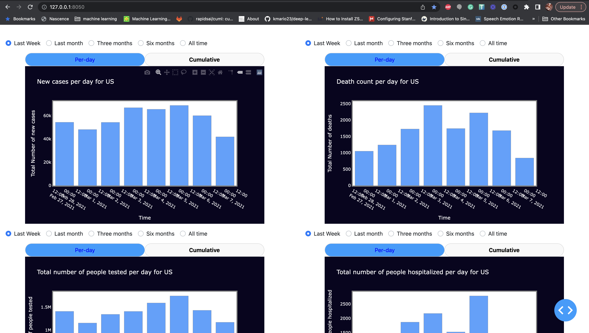
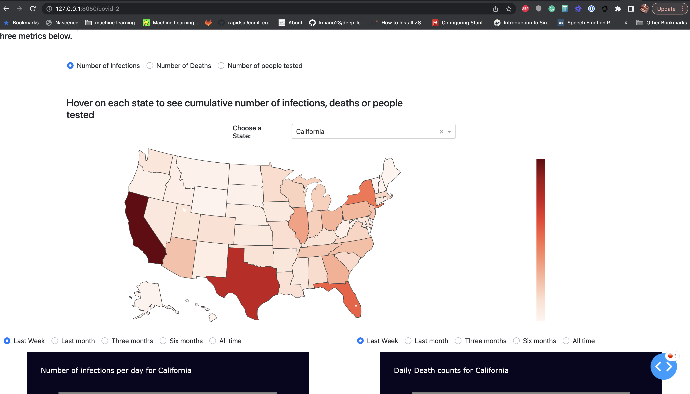
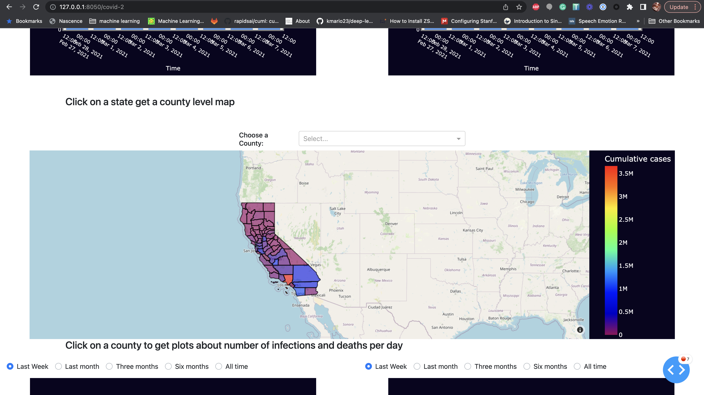

This covid dashboard uses plotly dash to generate a multpage application with data visualiztions that drills down covid, hospitalizations and deaths at national level to county level. See more [details about this dashboard on my blog here](https://www.pawannandakishore.com/project/20210111-covid-dashboard)
Here are a few screenshots from the dashboard: 

